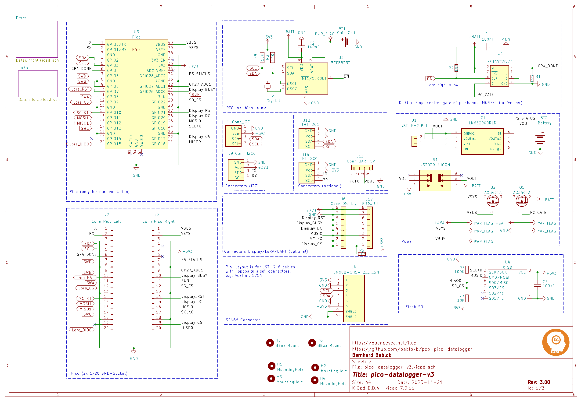
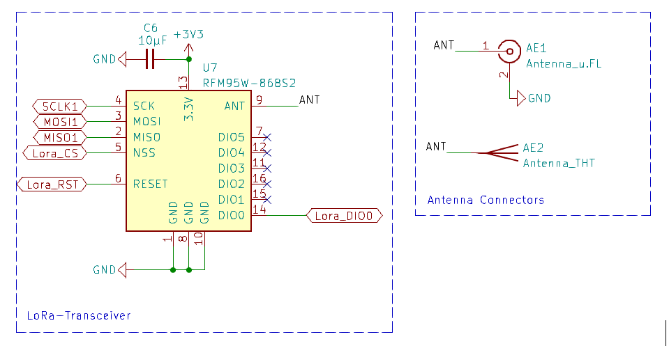
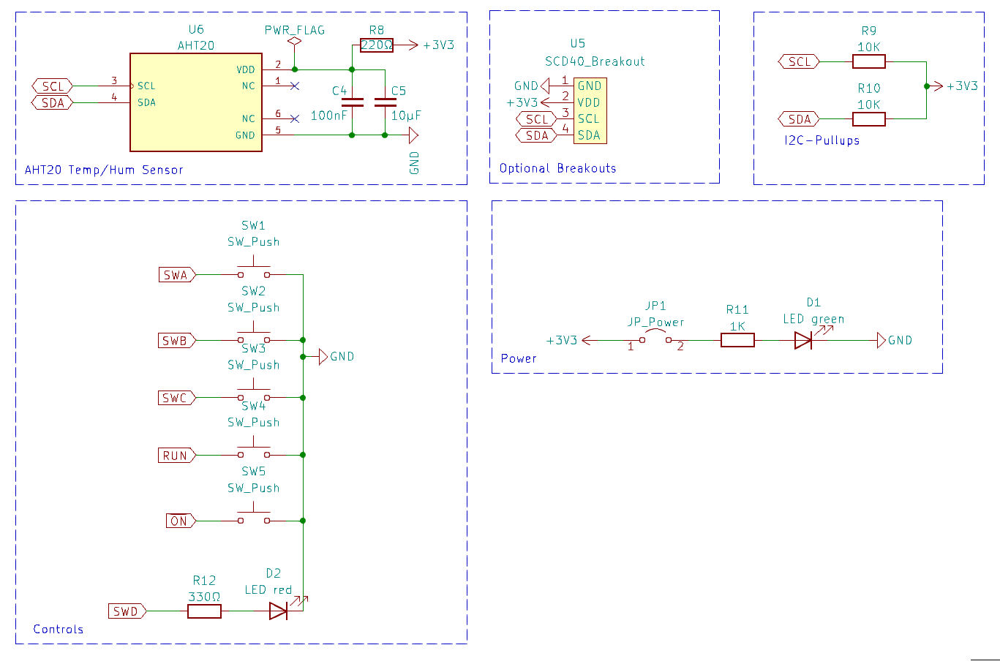
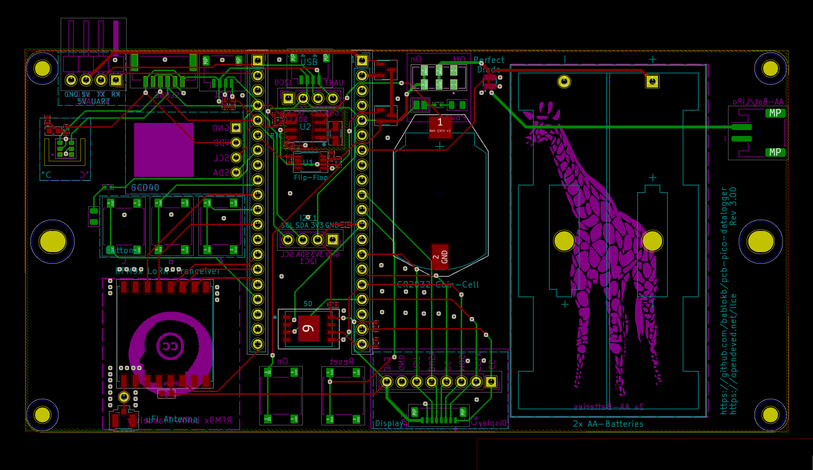
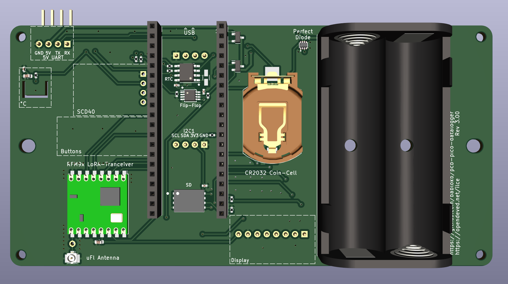
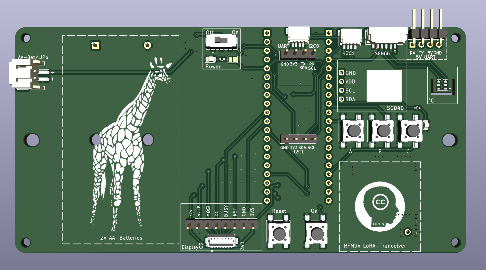

KiCAD-Designfiles for Version 3 PCB
===================================

Here are the KiCAD (v7) design-files for the Datalogger-V3-PCB.

The PCB supports a
[display-adapter](https://github.com/bablokb/pcb-datalogger-display-adapter)
connected with SURS-cables, or an [adapter connected with normal
DuPont-sockets](https://github.com/bablokb/pcb-datalogger-display-adapter-v2).

Schematic
---------

Layout
------

3D-Views
--------

Printed Case
------------

A printed case is available from <https://github.com/bablokb/3D-datalogger-v3-case>:

Together with a display:

License
-------

[![CC BY-SA 4.0][cc-by-sa-shield]][cc-by-sa]

This work is licensed under a
[Creative Commons Attribution-ShareAlike 4.0 International
License][cc-by-sa].

[![CC BY-SA 4.0][cc-by-sa-image]][cc-by-sa]

[cc-by-sa]: http://creativecommons.org/licenses/by-sa/4.0/
[cc-by-sa-image]: https://licensebuttons.net/l/by-sa/4.0/88x31.png
[cc-by-sa-shield]:
https://img.shields.io/badge/License-CC%20BY--SA%204.0-lightgrey.svg
